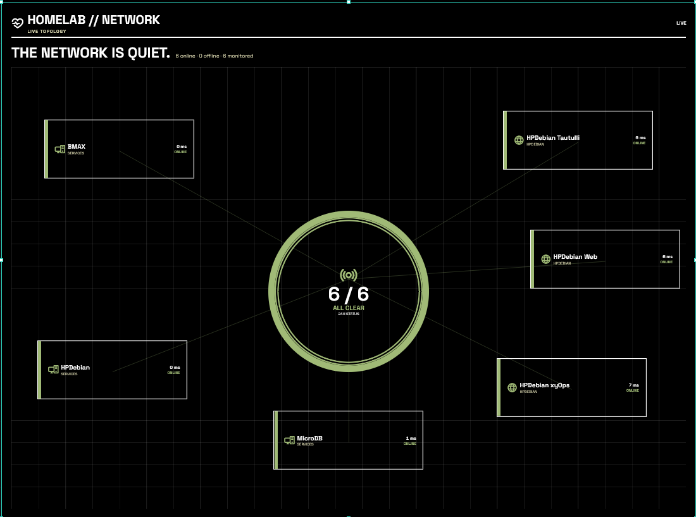
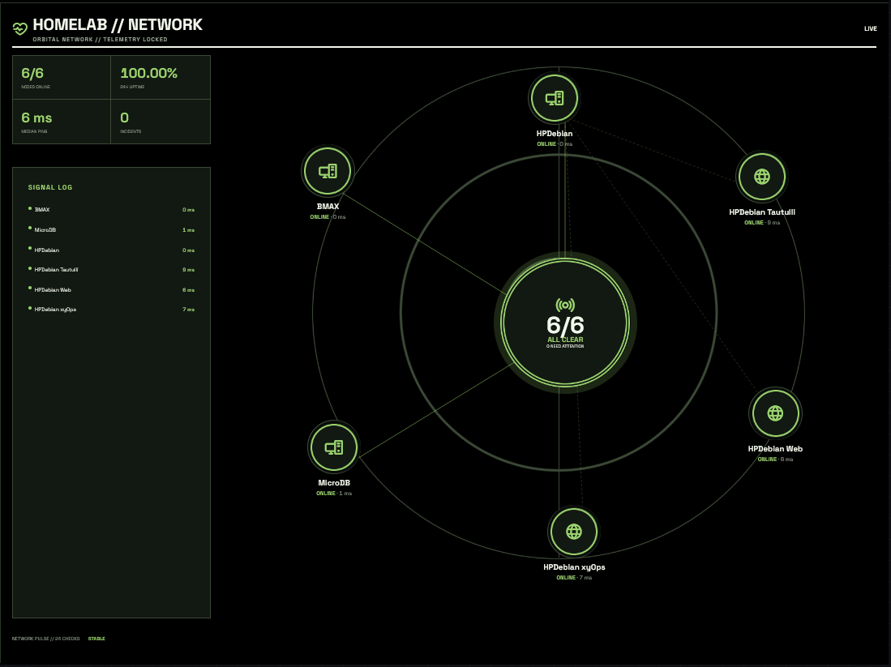
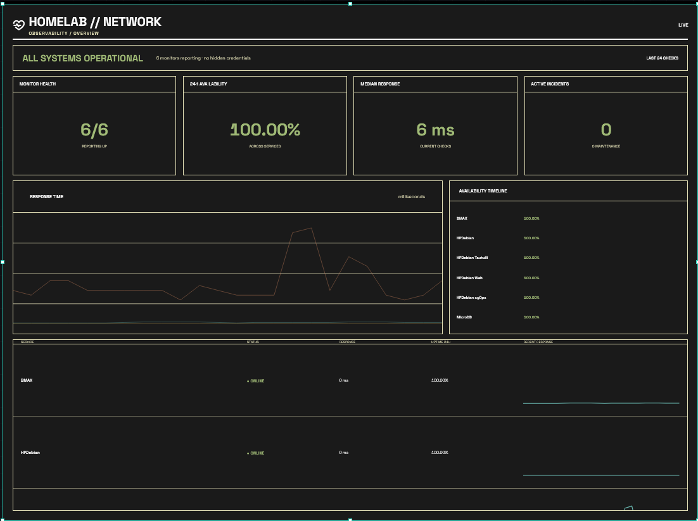
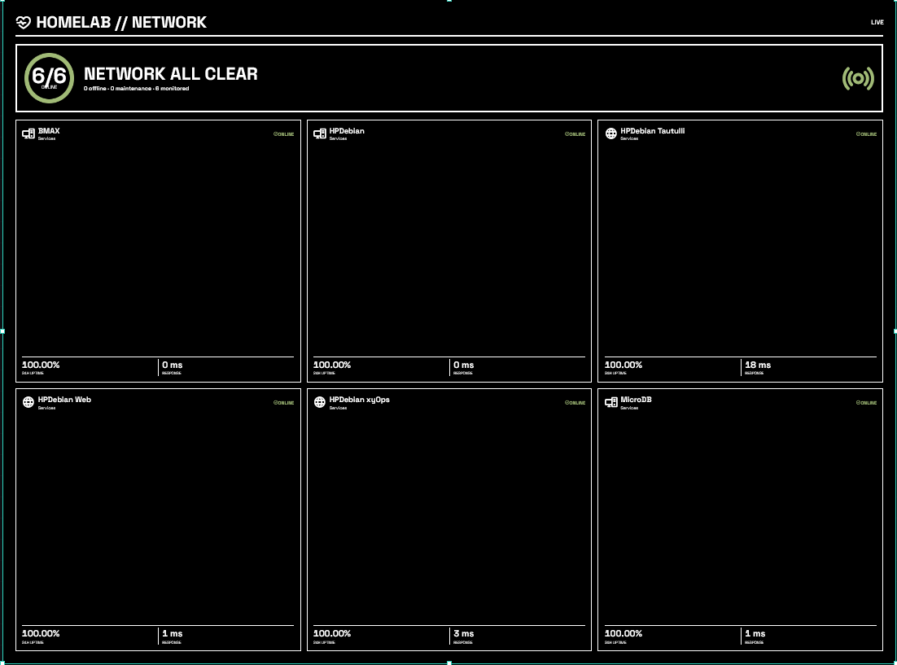
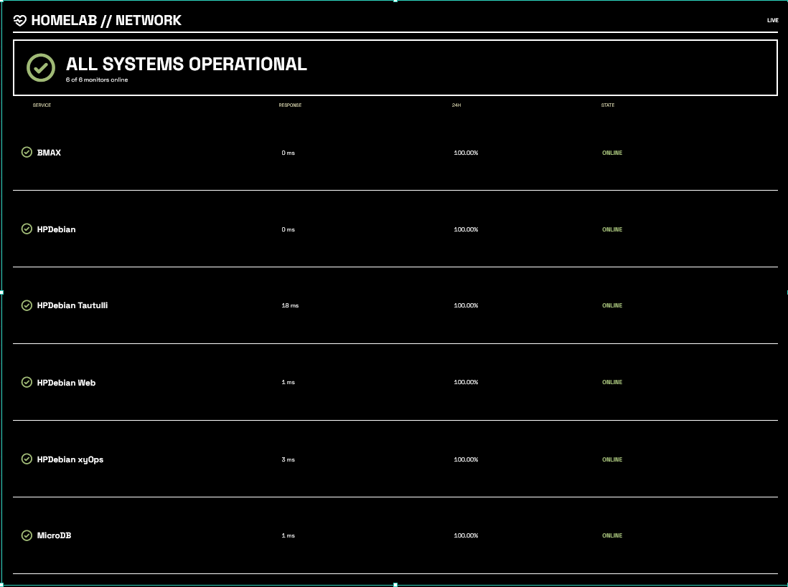
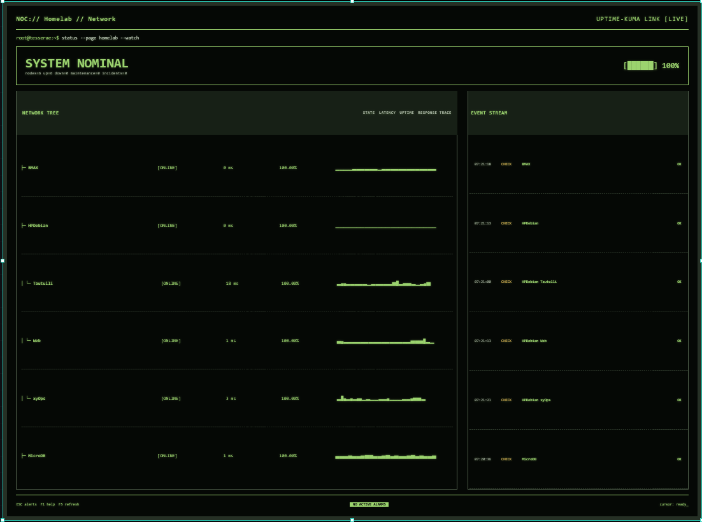
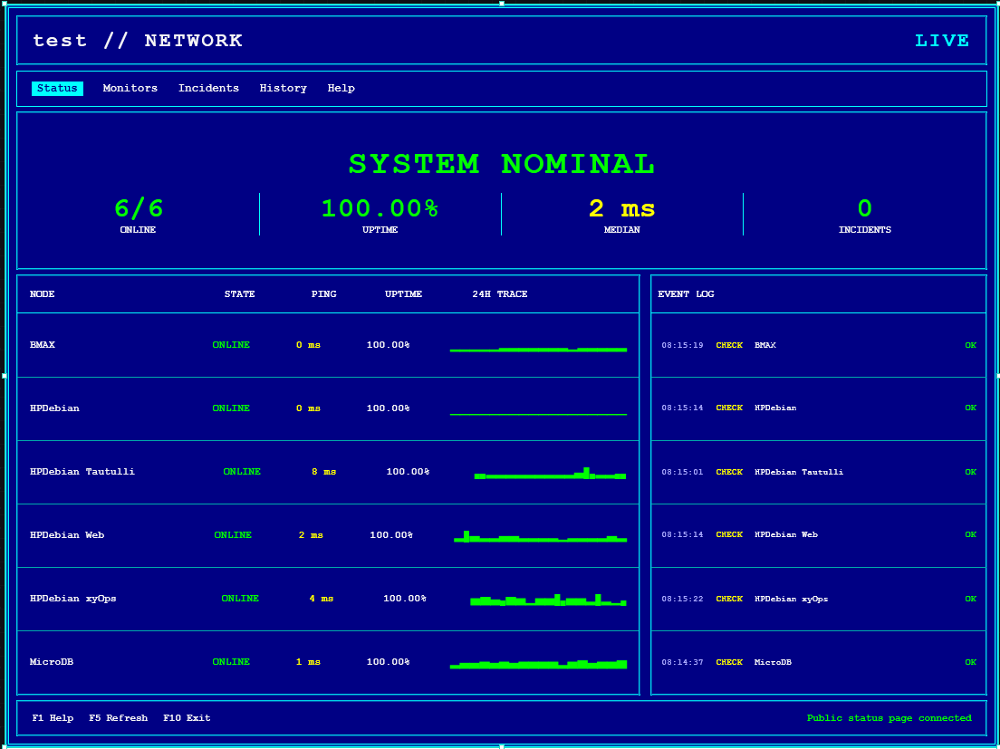
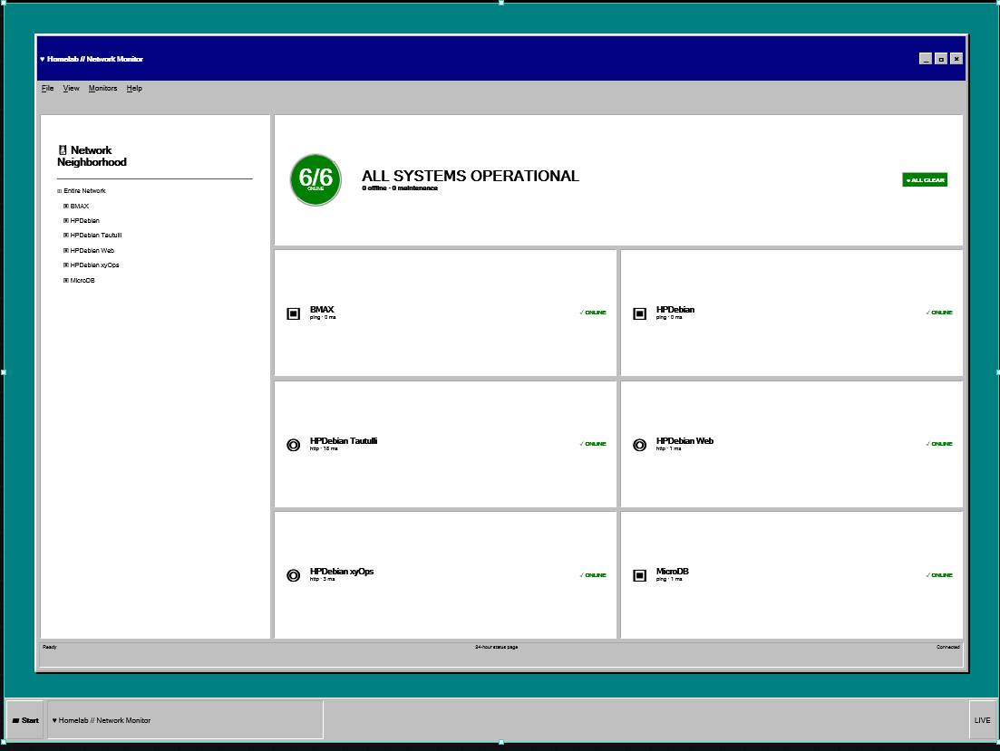
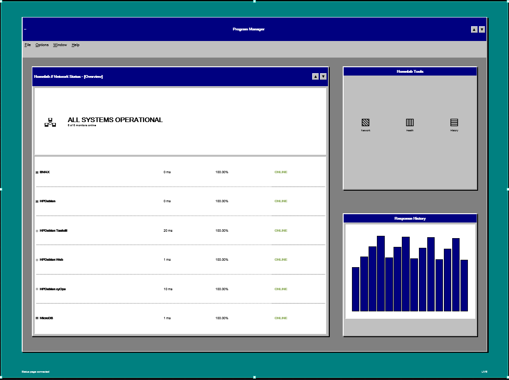

# Uptime Kuma Incident Board for Tesserae

A configurable, failure-first Uptime Kuma dashboard widget for [Tesserae](https://github.com/dmellok/tesserae). It reads a published Uptime Kuma status page and turns its public monitor data into nine presentations ranging from minimal status lists to an orbital network map and retro operating-system interfaces.

Created and published by **N4ASS**. Licensed under the MIT License.

## Reference hardware

Designed and tested on a **Seeed Studio reTerminal E1003** with an **1872 x 1404** color e-paper display. Every layout also responds to Tesserae's `xs`, `sm`, `md`, and `lg` cell sizes for use on other supported panels.

## Highlights

- Reads a published Uptime Kuma status page without administrator credentials
- Displays UP, DOWN, PENDING, MAINTENANCE, and UNKNOWN states
- Shows monitor names, response times, failure messages, 24-hour uptime, and recent heartbeats
- Prioritizes failures and active incidents
- Supports up to 12 visible monitors per cell
- Provides nine independently selectable display styles
- Uses substantially enlarged, e-paper-friendly typography across every layout, refined through real-device E1003 review
- Supports forced light or dark rendering independently of the dashboard theme
- Caches normalized data for one minute and falls back to stale data during temporary connection failures
- Escapes remote strings before inserting them into rendered markup
- Validates URLs, enumerated options, limits, booleans, and custom colors server-side

## Display styles

### Constellation

The default topology view. Monitor cards surround a central all-clear or alert hub and are connected with status-aware lines.

### Orbital Constellation

A dark command-center presentation with radar rings, a signal log, summary telemetry, circular monitor nodes, and automatic parent/child relationships. It includes the most extensive customization options.

### Grafana Operations

A panel-based observability view with monitor health, average availability, median response time, incidents, latency traces, availability timelines, and service rows.

### Operations Grid

A direct 3 x 2 service-card layout with state, latency, uptime, and heartbeat strips. Useful when every monitor should receive equal visual weight.

### Minimal Status

A restrained overview and compact failure-first list for smaller cells or dashboards that contain several different widgets.

### Terminal / NOC Console

A dark monospace network-operations console with an inferred ASCII hierarchy, aligned health data, response traces, an event stream, and prominent incident alarms.

### DOS Network Manager

An authentic 16-color DOS-style network manager with cyan box-drawing panels, a keyboard menu, large health summary, aligned monitor table, block-character response traces, and event log.

### Windows 95

A playful Network Neighborhood-style presentation with classic window chrome, status panels, service tiles, and a taskbar.

### Windows 3.11

A denser Program Manager-inspired presentation with overlapping status, tools, and response-history windows.

## Screenshot gallery

Captured from the reference Seeed Studio reTerminal E1003 dashboard at an 1872 x 1404 render target.

| Constellation | Orbital Constellation |
|---|---|
|  |  |

| Grafana Operations | Operations Grid |
|---|---|
|  |  |

| Minimal Status | Terminal / NOC Console |
|---|---|
|  |  |

<table>
  <tr>
    <th width="50%">DOS Network Manager</th>
    <th width="50%"></th>
  </tr>
  <tr>
    <td width="50%"></td>
    <td width="50%"></td>
  </tr>
</table>

| Windows 95 | Windows 3.11 |
|---|---|
|  |  |

## Requirements

- A running Tesserae 1.x installation
- A running Uptime Kuma installation reachable from the Tesserae server
- A published Uptime Kuma status page containing the monitors you want to display

Uptime Kuma can remain private to your LAN. Publishing a status page makes that page accessible to clients that can already reach your Kuma server; it does not require exposing Kuma to the Internet.

## Uptime Kuma setup

1. Open Uptime Kuma.
2. Create or edit a status page.
3. Add every individual monitor that should appear in Tesserae.
4. Publish the status page.
5. Note the slug at the end of its URL. For `/status/homelab`, the slug is `homelab`.

Group monitors work, but individual monitors provide more useful outage names, latency data, and topology nodes.

## Tesserae configuration

Add **Uptime Kuma, Incident Board** to a dashboard cell and configure:

| Option | Purpose | Default |
|---|---|---|
| Uptime Kuma URL | Base address of Kuma, such as `http://192.168.1.20:3001` | `http://localhost:3001` |
| Status page slug | Final component of the published status-page URL | `homelab` |
| Title | Optional cell heading; the Kuma page title is used when empty | Empty |
| Display style | Selects one of the nine renderers | Constellation |
| Color scheme | Follow Tesserae, force light, or force dark | Follow Tesserae |
| Information density | Comfortable or compact spacing | Comfortable |
| Show heartbeat history | Shows or hides recent check strips | On |
| Maximum monitors | Limits the monitors rendered in this cell | 8 |

All presentation settings are stored per cell. Multiple cells may point to the same status page while using different layouts and appearance options. They share the same normalized Kuma cache without sharing presentation choices.

## Orbital Constellation options

| Option | Choices or behavior |
|---|---|
| Orbital topology | Automatic hierarchy, Star, or Orbit only |
| Show secondary connections | Displays parent-to-child dashed links |
| Relationship overrides | Optional `Child=Parent` entries, one per line |
| Radar background | Rings and grid, Rings only, Grid only, or None |
| Orbital node size | Small, Medium, or Large |
| Connection thickness | Thin, Medium, or Heavy |
| Show signal log | Shows current monitor checks in the side panel |
| Show summary metrics | Shows health, availability, response, and incident totals |
| Node details | Name only, Name and status, or Full details |
| Heartbeat length | 8, 12, or 24 checks |
| Orbital accent color | User-selected six-digit color |
| Orbital darkness | Standard dark or Pure black |

### Automatic relationships

Automatic hierarchy uses monitor-name prefixes. Given these monitors:

```text
Media Server
Media Server Tautulli
Media Server Library
```

the latter two become children of `Media Server`.

Explicit overrides take priority and use one entry per line:

```text
Tautulli=Media Server
Library API=Media Server
```

Both names must match published monitor names exactly, ignoring capitalization.

## Installation from a release archive

Extract the widget folder and mount it into Tesserae's plugin directory. Example Docker Compose entry:

```yaml
services:
  tesserae:
    volumes:
      - ./uptime_kuma_incidents:/app/plugins/uptime_kuma_incidents:ro
```

Restart Tesserae after installing or updating the files. The widget should then appear in the dashboard cell picker. Catalog installations are handled automatically by Tesserae after this widget is accepted into the community catalog.

## Data access and privacy

The server component makes two read-only requests to the configured Kuma host:

```text
GET /api/status-page/<slug>
GET /api/status-page/heartbeat/<slug>
```

The widget:

- Does not request or store an Uptime Kuma username, password, session, API key, or push token
- Does not contact analytics, telemetry, advertising, or developer-controlled services
- Sends no monitor data anywhere except between the configured Kuma server and Tesserae
- Writes cache files only inside the `data_dir` assigned by Tesserae
- Keys cache files by a SHA-256 digest of the Kuma base URL and page slug
- Declares `network:*` because each user supplies a different local or remote Kuma hostname

The cached JSON contains normalized public status-page information only. Cache lifetime is 60 seconds. If Kuma is temporarily unavailable, the most recent cache is displayed and marked `CACHED`.

## Compatibility note

Uptime Kuma's published status-page endpoints are used by its own public frontend but are currently considered an internal interface. A future Kuma version could change their response structure. The parser is intentionally defensive, and incompatible changes should result in an error or unknown state instead of exposing credentials or executing remote content.

## Troubleshooting

### Widget cannot reach Uptime Kuma

Confirm the Tesserae host can reach both endpoints:

```bash
curl -fsS http://192.168.1.20:3001/api/status-page/homelab
curl -fsS http://192.168.1.20:3001/api/status-page/heartbeat/homelab
```

Check that the status page is published and the slug is correct.

### Only group names appear

Edit the Kuma status page and add its individual monitors. A group monitor exposes the aggregate group state but cannot identify which child service failed.

### A new layout option does not appear

Restart Tesserae and hard-refresh the browser after updating the plugin files.

### Orbital relationships are incorrect

Use Relationship overrides with exact monitor names, one `Child=Parent` entry per line.

### Dark layouts consume more ink

Pure-black and dark layouts are visually striking but repaint more pigment and may produce more visible ghosting than light layouts on some e-paper panels.

## Development and validation

The repository contains:

```text
plugin.json          Tesserae manifest and cell options
server.py            Status-page fetch, normalization, validation, and cache
client.js            All nine responsive renderers
tests/test_widget.py Server normalization and validation tests
```

Run the server tests with `pytest` when available:

```bash
python3 -m pytest -q
```

Basic dependency-free checks:

```bash
python3 -m py_compile server.py tests/test_widget.py
node --check client.js
python3 -c 'import json; json.load(open("plugin.json"))'
```

## Security reports

Please open a private GitHub security advisory for vulnerabilities. Do not include real status-page contents, private hostnames, LAN addresses, credentials, or tokens in public issues.

## Author

Created and maintained by **N4ASS**.

## License

[MIT](LICENSE)
